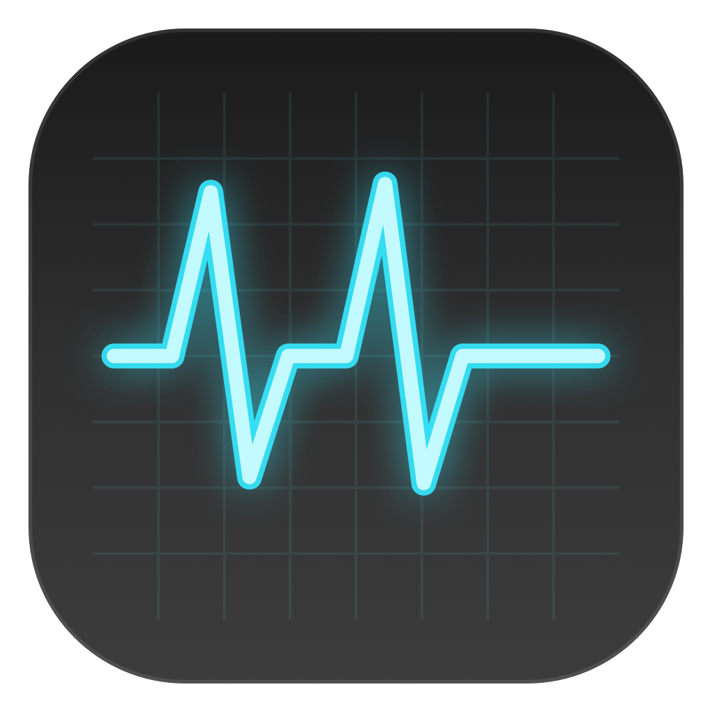

# NewNet



NewNet is a lightweight macOS menu‑bar download manager built around `yt-dlp`. It focuses on quick pasting, explicit format selection, and reliable merging of video + audio into a single file.

## Features

- Menu‑bar UI with quick paste and one‑click downloads.
- Format picker for supported media links (video/audio/resolution/codec).
- `yt-dlp` integration with automatic `ffmpeg` merging for separate audio/video streams.
- Direct download support with resumable transfers.
- Per‑download progress, speed, and status.
- Recent downloads list with quick access to the Downloads folder.
- Sparkle-based auto updates (outside App Store).
- Privacy-friendly anonymous usage analytics with opt-out in Settings.

## Requirements

- macOS 15+.
- `yt-dlp` installed (NewNet can download it automatically).
- `ffmpeg` is bundled in release builds (auto-installs when running from source).

## Download

Get the latest DMG from GitHub Releases.

## Install

1. Open the DMG.
2. Drag `NewNet.app` into `/Applications`.
3. Launch NewNet from Applications (it runs in the menu bar).

### If macOS blocks the app (quarantine)

```bash
xattr -dr com.apple.quarantine /Applications/NewNet.app
```

## Usage

1. Launch NewNet from the menu bar.
2. Paste a supported link.
3. Choose Video or Audio, then select a format from the list.
4. Click Download. Progress updates live in the download row.

## Build (Developer)

```bash
xcodebuild -scheme NewNet -configuration Release -derivedDataPath build/DerivedData CODE_SIGNING_ALLOWED=NO CODE_SIGNING_REQUIRED=NO
```

To generate a DMG:

```bash
/Users/nn/Desktop/internetManager/NewNet/make_dmg.sh
```

## Updates and Analytics Docs

- Update integration and release checklist: `docs/UPDATES.md`
- Analytics event contract and privacy details: `docs/ANALYTICS.md`
- Cloudflare endpoint setup: `docs/CLOUDFLARE_ANALYTICS_SETUP.md`
- Example Sparkle feed template: `appcast.xml`
